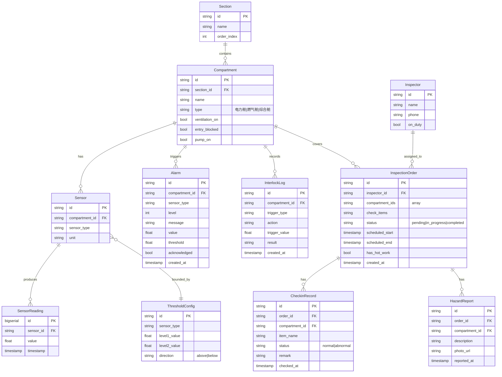

## 1. 架构设计

```mermaid
graph TB
    subgraph "前端层"
        "React+TS 控制台" --- "WebSocket Client"
        "React+TS 控制台" --- "REST API Client"
    end
    subgraph "后端层"
        "FastAPI" --- "WebSocket Server"
        "FastAPI" --- "REST API"
        "FastAPI" --- "告警判定引擎"
        "FastAPI" --- "联动执行器"
        "FastAPI" --- "巡检防冲突校验"
        "FastAPI" --- "传感器模拟器"
    end
    subgraph "数据层"
        "PostgreSQL"
    end
    "WebSocket Client" --> "WebSocket Server"
    "REST API Client" --> "REST API"
    "WebSocket Server" --> "传感器模拟器"
    "传感器模拟器" --> "告警判定引擎"
    "告警判定引擎" --> "联动执行器"
    "告警判定引擎" --> "PostgreSQL"
    "联动执行器" --> "PostgreSQL"
    "REST API" --> "PostgreSQL"
    "巡检防冲突校验" --> "PostgreSQL"
```

## 2. 技术选型
- 前端：React 18 + TypeScript + Vite + TailwindCSS + Zustand
- 后端：FastAPI (Python 3.11+) + Uvicorn
- 数据库：PostgreSQL 15
- 实时通信：WebSocket (FastAPI 内建)
- 容器编排：Docker Compose
- 对外端口：7293

## 3. 路由定义
| 路由 | 用途 |
|------|------|
| `/` | 态势总览页（拓扑图+实时数据） |
| `/alarms` | 告警中心页 |
| `/inspections` | 巡检调度页 |
| `/settings` | 阈值配置页 |

## 4. API 定义

### 4.1 REST API

#### 管廊结构
- `GET /api/sections` — 获取所有舱段
- `GET /api/compartments` — 获取所有舱室（含所属舱段）
- `GET /api/compartments/{id}/sensors` — 获取舱室下所有传感器最新读数

#### 告警
- `GET /api/alarms` — 获取告警列表（支持 ?level=&compartment_id=&status= 筛选）
- `GET /api/alarms/{id}` — 获取告警详情
- `PUT /api/alarms/{id}/acknowledge` — 确认告警

#### 联动日志
- `GET /api/interlock-logs` — 获取联动日志列表（支持 ?compartment_id= 筛选）

#### 巡检工单
- `GET /api/inspections` — 获取工单列表（支持 ?status=&inspector_id= 筛选）
- `POST /api/inspections` — 创建工单（含防冲突校验）
- `PUT /api/inspections/{id}/status` — 更新工单状态
- `POST /api/inspections/{id}/checkin` — 巡检员打卡上报
- `POST /api/inspections/{id}/hazard` — 上报隐患（含图片）

#### 阈值配置
- `GET /api/thresholds` — 获取所有阈值配置
- `PUT /api/thresholds/{id}` — 更新阈值

#### 巡检员
- `GET /api/inspectors` — 获取巡检员列表

### 4.2 WebSocket
- `WS /ws/sensor-data` — 实时传感器数据流（模拟器每秒推送）

#### 推送消息格式
```typescript
interface SensorReading {
  sensor_id: string;
  compartment_id: string;
  sensor_type: "temperature" | "humidity" | "oxygen" | "gas" | "water_level" | "fire_door";
  value: number | string;
  unit: string;
  timestamp: string;
}

interface AlarmEvent {
  alarm_id: string;
  compartment_id: string;
  sensor_type: string;
  level: 1 | 2 | 3;
  message: string;
  value: number;
  threshold: number;
  timestamp: string;
}

interface InterlockEvent {
  log_id: string;
  compartment_id: string;
  trigger_type: string;
  action: string;
  trigger_value: number;
  timestamp: string;
}

type WSMessage =
  | { type: "sensor_data"; payload: SensorReading[] }
  | { type: "alarm"; payload: AlarmEvent }
  | { type: "interlock"; payload: InterlockEvent };
```

## 5. 后端架构图

```mermaid
graph LR
    "API Router" --> "Service Layer"
    "Service Layer" --> "Repository Layer"
    "Repository Layer" --> "PostgreSQL"
    "WS Endpoint" --> "Simulator"
    "Simulator" --> "Alarm Engine"
    "Alarm Engine" --> "Interlock Executor"
    "Interlock Executor" --> "Repository Layer"
```

## 6. 数据模型

### 6.1 ER 图



### 6.2 DDL

```sql
CREATE TABLE section (
    id VARCHAR(36) PRIMARY KEY DEFAULT gen_random_uuid()::text,
    name VARCHAR(100) NOT NULL,
    order_index INTEGER NOT NULL
);

CREATE TABLE compartment (
    id VARCHAR(36) PRIMARY KEY DEFAULT gen_random_uuid()::text,
    section_id VARCHAR(36) NOT NULL REFERENCES section(id),
    name VARCHAR(100) NOT NULL,
    type VARCHAR(50) NOT NULL,
    ventilation_on BOOLEAN DEFAULT FALSE,
    entry_blocked BOOLEAN DEFAULT FALSE,
    pump_on BOOLEAN DEFAULT FALSE
);

CREATE TABLE sensor (
    id VARCHAR(36) PRIMARY KEY DEFAULT gen_random_uuid()::text,
    compartment_id VARCHAR(36) NOT NULL REFERENCES compartment(id),
    sensor_type VARCHAR(50) NOT NULL,
    unit VARCHAR(20) NOT NULL
);

CREATE TABLE sensor_reading (
    id BIGSERIAL PRIMARY KEY,
    sensor_id VARCHAR(36) NOT NULL REFERENCES sensor(id),
    value DOUBLE PRECISION NOT NULL,
    timestamp TIMESTAMPTZ NOT NULL DEFAULT NOW()
);

CREATE INDEX idx_sensor_reading_sensor_time ON sensor_reading(sensor_id, timestamp DESC);

CREATE TABLE threshold_config (
    id VARCHAR(36) PRIMARY KEY DEFAULT gen_random_uuid()::text,
    sensor_type VARCHAR(50) NOT NULL UNIQUE,
    level1_value DOUBLE PRECISION NOT NULL,
    level2_value DOUBLE PRECISION NOT NULL,
    direction VARCHAR(10) NOT NULL DEFAULT 'above'
);

CREATE TABLE alarm (
    id VARCHAR(36) PRIMARY KEY DEFAULT gen_random_uuid()::text,
    compartment_id VARCHAR(36) NOT NULL REFERENCES compartment(id),
    sensor_type VARCHAR(50) NOT NULL,
    level INTEGER NOT NULL,
    message TEXT NOT NULL,
    value DOUBLE PRECISION NOT NULL,
    threshold DOUBLE PRECISION NOT NULL,
    acknowledged BOOLEAN DEFAULT FALSE,
    created_at TIMESTAMPTZ NOT NULL DEFAULT NOW()
);

CREATE INDEX idx_alarm_compartment ON alarm(compartment_id);
CREATE INDEX idx_alarm_level ON alarm(level);
CREATE INDEX idx_alarm_created ON alarm(created_at DESC);

CREATE TABLE interlock_log (
    id VARCHAR(36) PRIMARY KEY DEFAULT gen_random_uuid()::text,
    compartment_id VARCHAR(36) NOT NULL REFERENCES compartment(id),
    trigger_type VARCHAR(50) NOT NULL,
    action VARCHAR(100) NOT NULL,
    trigger_value DOUBLE PRECISION NOT NULL,
    result VARCHAR(50) NOT NULL DEFAULT 'executed',
    created_at TIMESTAMPTZ NOT NULL DEFAULT NOW()
);

CREATE INDEX idx_interlock_compartment ON interlock_log(compartment_id);

CREATE TABLE inspector (
    id VARCHAR(36) PRIMARY KEY DEFAULT gen_random_uuid()::text,
    name VARCHAR(100) NOT NULL,
    phone VARCHAR(20),
    on_duty BOOLEAN DEFAULT TRUE
);

CREATE TABLE inspection_order (
    id VARCHAR(36) PRIMARY KEY DEFAULT gen_random_uuid()::text,
    inspector_id VARCHAR(36) NOT NULL REFERENCES inspector(id),
    compartment_ids TEXT[] NOT NULL,
    check_items TEXT NOT NULL,
    status VARCHAR(20) NOT NULL DEFAULT 'pending',
    scheduled_start TIMESTAMPTZ NOT NULL,
    scheduled_end TIMESTAMPTZ NOT NULL,
    has_hot_work BOOLEAN DEFAULT FALSE,
    created_at TIMESTAMPTZ NOT NULL DEFAULT NOW()
);

CREATE INDEX idx_inspection_status ON inspection_order(status);

CREATE TABLE checkin_record (
    id VARCHAR(36) PRIMARY KEY DEFAULT gen_random_uuid()::text,
    order_id VARCHAR(36) NOT NULL REFERENCES inspection_order(id),
    compartment_id VARCHAR(36) NOT NULL REFERENCES compartment(id),
    item_name VARCHAR(100) NOT NULL,
    status VARCHAR(20) NOT NULL,
    remark TEXT,
    checked_at TIMESTAMPTZ NOT NULL DEFAULT NOW()
);

CREATE TABLE hazard_report (
    id VARCHAR(36) PRIMARY KEY DEFAULT gen_random_uuid()::text,
    order_id VARCHAR(36) NOT NULL REFERENCES inspection_order(id),
    compartment_id VARCHAR(36) NOT NULL REFERENCES compartment(id),
    description TEXT NOT NULL,
    photo_url TEXT,
    reported_at TIMESTAMPTZ NOT NULL DEFAULT NOW()
);
```

## 7. Docker Compose 编排

```yaml
services:
  db:
    image: postgres:15
    environment:
      POSTGRES_DB: tunnel
      POSTGRES_USER: tunnel
      POSTGRES_PASSWORD: tunnel123
    volumes:
      - pgdata:/var/lib/postgresql/data
      - ./backend/init.sql:/docker-entrypoint-initdb.d/init.sql
    ports:
      - "5432"

  backend:
    build: ./backend
    environment:
      DATABASE_URL: postgresql://tunnel:tunnel123@db:5432/tunnel
    depends_on:
      - db
    ports:
      - "7293:8000"

  frontend:
    build: ./frontend
    ports:
      - "7293"
    depends_on:
      - backend

  nginx:
    image: nginx:alpine
    ports:
      - "7293:80"
    volumes:
      - ./nginx.conf:/etc/nginx/conf.d/default.conf
    depends_on:
      - frontend
      - backend

volumes:
  pgdata:
```

前端通过 Nginx 反向代理统一对外暴露 7293 端口，`/api/*` 和 `/ws/*` 转发至后端，其余转发至前端。
